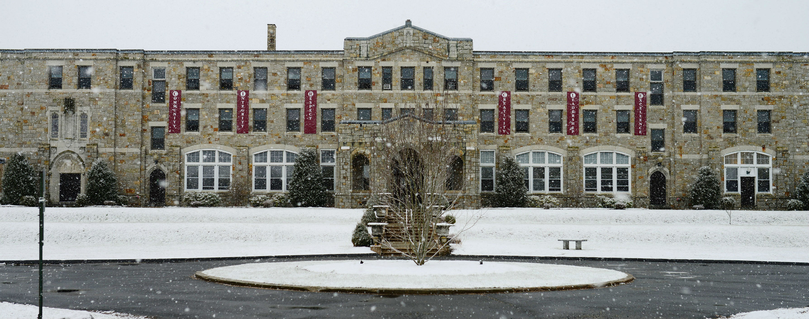
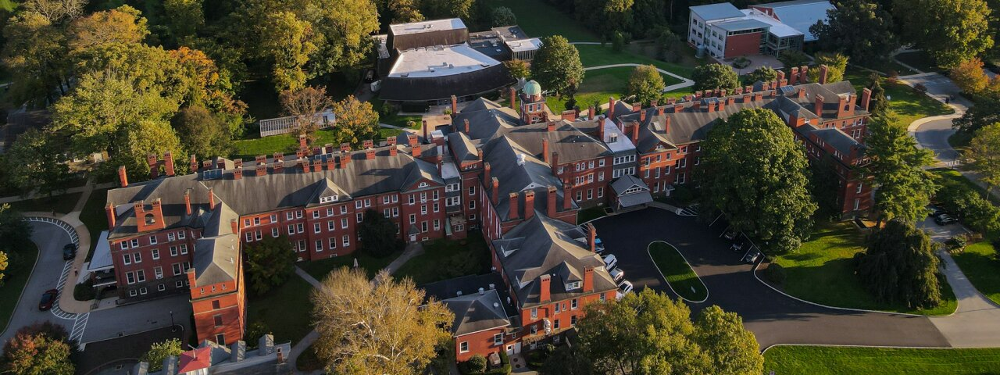

# Basketball is an amazing sport

I played basketball since I was 12 years old. Since then it is a sport that has opened a lot of door for me and get into prestigeous schools like UW

## The Beginning
My story all started when I move to the United State from cameroon when I was 14 years old. I went to a boarding school called The MacDuffie School

At the time I was not very good at the game, I struggled with coordination and understanding the game. Slowly but surely I got better and was able to build a name for myself.
I did two wonderful years there then I transferred to a another school called Westtown school where I did another two years.

## The Next Steps
The next Step in my journey was when I commited to the University of oregon. My first year in college was sureal. it was during the pandemic which was a different college expereince both on and off the court. Basketball wise we made it all the way to the sweet sixthteen of the NCAA tournament
Next In the Summer of 2022 I tranferred to UW and I became a Husky!!

## Reflection
<i>
Each year That I spend in my journey, it had given me an opportunity to grow as a person more as much as I continued to develop as a basketball player. It also helped me to cultivate my passion outside of the court
</i>

## See also
<b>
- [Resource 1](https://macduffie.org/)
- [Resource 2](https://www.westtown.edu/)
- [Resource 3](https://goducks.com/sports/mens-basketball/roster/2020-21)
- [Resource 4](https://gohuskies.com/sports/mens-basketball/roster/franck-kepnang/15171)
</b>